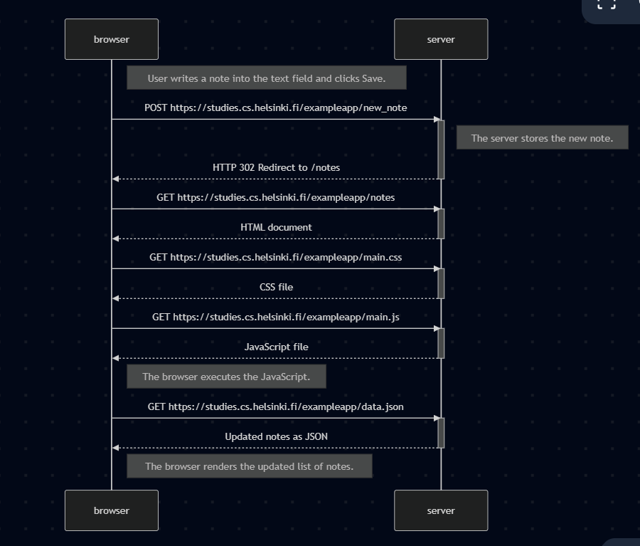

## New Note Diagram 

sequenceDiagram
    participant browser
    participant server

    Note right of browser: User writes a note and clicks the Save button.

    browser->>server: POST https://studies.cs.helsinki.fi/exampleapp/new_note
    activate server
    Note right of server: Server stores the new note
    server-->>browser: HTTP 302 Redirect to /notes
    deactivate server

    browser->>server: GET https://studies.cs.helsinki.fi/exampleapp/notes
    activate server
    server-->>browser: HTML document
    deactivate server

    browser->>server: GET main.css
    activate server
    server-->>browser: CSS file
    deactivate server

    browser->>server: GET main.js
    activate server
    server-->>browser: JavaScript file
    deactivate server

    browser->>server: GET data.json
    activate server
    server-->>browser: Updated list of notes (JSON)
    deactivate server

    Note right of browser: Browser renders the updated notes list including the new note.

### New Note Diagram

