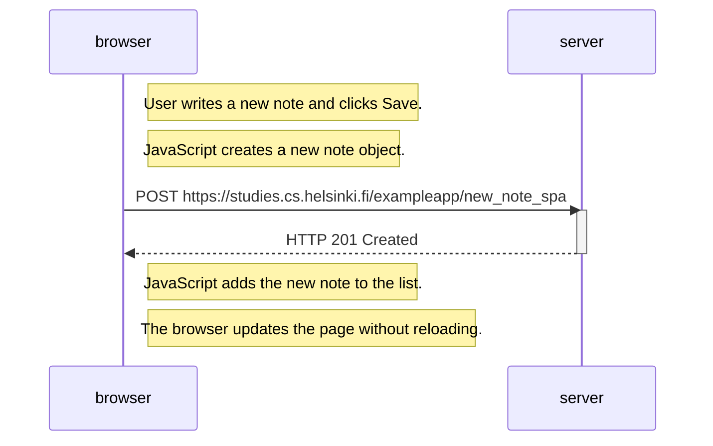
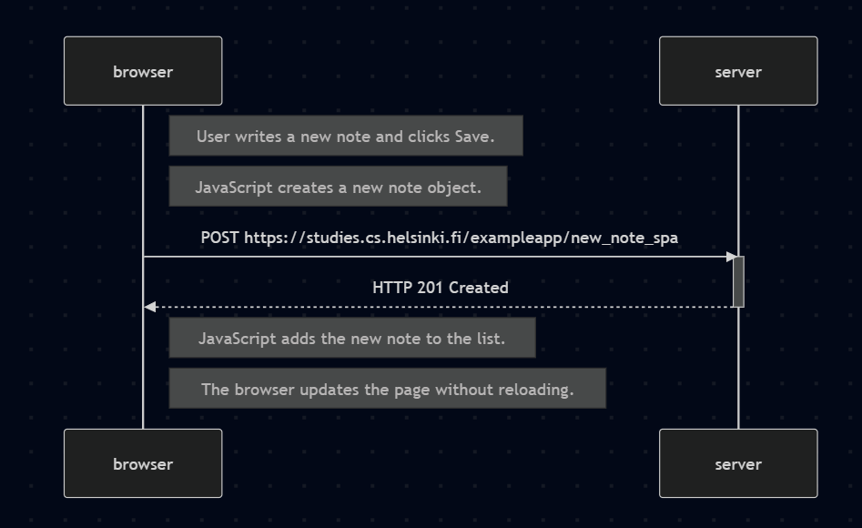

### New Note in Single Page App 

```mermaid
sequenceDiagram
    participant browser
    participant server

    Note right of browser: User writes a new note and clicks Save.

    Note right of browser: JavaScript creates a new note object.

    browser->>server: POST https://studies.cs.helsinki.fi/exampleapp/new_note_spa
    activate server
    server-->>browser: HTTP 201 Created
    deactivate server

    Note right of browser: JavaScript adds the new note to the list.
    Note right of browser: The browser updates the page without reloading.
```

### New Note in Single Page App Diagram

